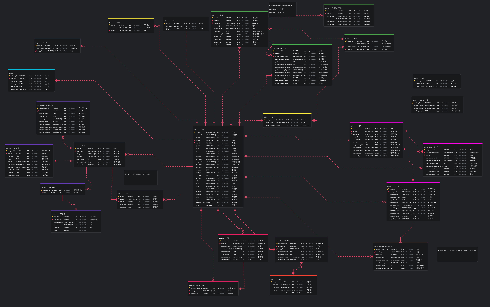

# 🗒 Unite
"Unite" 프로젝트는 조직의 내부 프로세스를 통합 관리할 수 있는   
종합 그룹웨어 솔루션 개발을 목표로 하고 있습니다.

이 프로젝트는 직원 정보 관리, GPS 기반 출퇴근 관리, 자원 예약, 프로젝트 협업 등   
다양한 기능을 제공하여 조직 내에서 생산성을 높이고 팀 협업을 촉진하는 통합된 업무 환경을 만들고자 합니다.

## 프로젝트 기능 및 설계
계정     – 로그인, 비밀번호 찾기   
메인화면 – 나의할일(일정, 결재 등 알림+팝업)   
인사정보 – 직원정보 확인   
캘린더   – 일정 및 행사 확인   
주소록   – 직원 연락처 확인   
근태관리 – 출근하기(GPS 위치 정보 포함), 근무형태(외근, 출장 등), 통계 확인   
게시판   – [공지사항, 일반게시판, 부서 게시판, 익명 게시판] → 작성, 수정, 삭제, 댓글, 답글   
전자문서 – 기안, 결재, 문서조회   
프로젝트 – 프로젝트 등록, Todo-List, 협업 부서 및 직원 지정, 일정 등록, 코멘트   
자원예약 – 회의실, 차량 등 자원 예약   
(파이널) 메신저   – 실시간 채팅 기능   
마이페이지 – 개인정보 변경, 작성 게시글 등 확인   
관리자   – 회원 등록, 회원정보 수정, 부서 추가, 자원등록 등   

## ERD

### Tech Stack
Java, JSP, Servlet, Oracle

