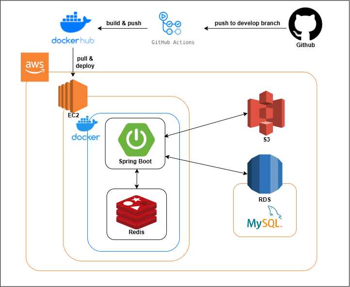

### **Unite**는 조직의 내부 프로세스를 통합 관리할 수 있는 **그룹웨어 솔루션**입니다.  
근태관리, 프로젝트 관리, 전자문서, 메신저, 자원예약 등 다양한 기능을 제공하여  
**생산성을 향상**시키고 **팀 협업을 촉진**하는 것을 목표로 합니다.

## 📅 진행 기간 & 인원

- **기간**: 6주 (`'24. 12 ~ '25. 02`)
- **인원**: 4명

---
##  🚩프로젝트 기능

 ### 김동하
- **계정 관리**: 로그인, 비밀번호 찾기, 비밀번호 변경
- **근태 관리**: 출근/퇴근 처리, 근무 형태(외근, 출장 등) 확인, 근태 기록 조회
- **인사 정보**: 인사 정보 조회 및 수정
- **주소록**: 내부/외부 주소록
- **전자문서** : 기안, 결재, 문서 조회 등
   - 일반문서
   - 휴가신청서
   - 출장신청서
   - 구매신청서
- **관리자 기능**
   - 직원 관리(등록, 수정, 삭제)
   - 휴일 설정
   - 공지사항 관리
   - 자원 관리
- **AI 기능**
   - 일정 확인 및 추가
   - 직원 연락처 조회
   - 휴가 신청
   - 채팅 메시지 요약 제공
   - 챗봇 지원
- **알림 기능**: 전자문서, 프로젝트, 게시판 등 **실시간 알림** 제공
- **기타**: 경제지표(주가지수, 주요국 환율) 제공, 날씨 정보 제공
---

### 강영훈
- **게시판**: 작성, 수정, 삭제, 댓글, 답글 기능, 게시판 관리(추가, 수정, 삭제)
   - 전사게시판
   - 일반게시판
   - 부서게시판
- **메신저**: 실시간 채팅 기능
---
### 윤한솔
- **프로젝트 관리**
   - 프로젝트 등록
   - Todo-List 관리
   - 협업 부서 및 직원 지정
   - 일정 등록 및 코멘트 작성
- **메인 화면**
- **기타**: 생일자 정보

---

### 최지영
- **캘린더**: 개인 일정, 공유 일정 관리
- **자원 예약**: 회의실, 차량 등 자원 예약

---

## 🔧 기술 스택

## 🏛 아키텍처

## 🧩 ERD

